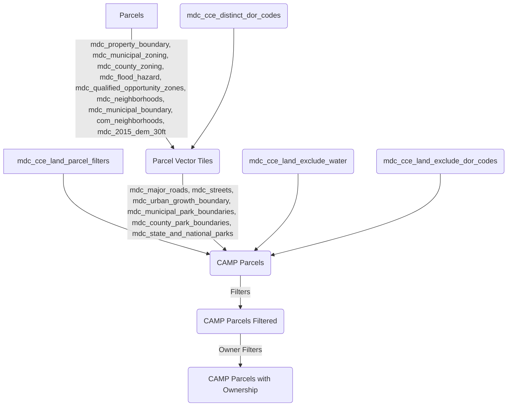

## CAMP Ownership Mapping

The code and data in this repo are used to assign specific ownership names and ownership categories to property parcels in Miami-Dade County according to criteria created by the University of Miami [Office for Community and Civic Engagement](https://civic.miami.edu/).

### Use
```bash
python camp_ownership_map.py <parcel_file.csv>
```

### Inputs

- OwnershipMap.csv
- parcel_file.csv

### OwnershipMap.csv

this is a five column csv file:
| Ownership     | true_owner[123] | Owner Categories  | dor_code_cur    | notes        |
|:--------------|:----------------|:------------------|:----------------|:-------------|
| Organization Name/Type | `<filter expression>` | Owner Category | not used | notes |

The `<filter expression>` is constructed as follows:
| Filter              | Action            |
|:--------------------| :---------------- 
| `MATCH TEXT[|...][|...]` | Contains MATCH TEXT in true_owner_1 |
| `MATCH TEXT!NOT MATCH TEXT[|...][|...]` | Contains MATCH TEXT in true_owner_1 `AND` does not contain NOT MATCH TEXT in true_owner_1 |
| `MATCH TRUE&&MATCH TEXT 2[|...][|...]` | Contains MATCH TEXT in true_owner_1 `AND` contains MATCH TEXT 2 in true_owner_2|
| `MATCH TEXT&&!NOT MATCH TEXT 2[|...][|...]` | Contains MATCH TEXT in true_owner_1 `AND` does not contain NOT MATCH TEXT 2 in true_owner_2|

notes:
- logic is always `OR` for lists delimited by the `|` character 
- match text for true_owner_1 can be blank with `&&`; `&&MATCH` means anything in true_owner_1 `AND` MATCH in true_owner_2
- `!` can be chained as long as needed
- there is no match on true_owner_3

diagram for entire data pipeline from parcels to ownership:


